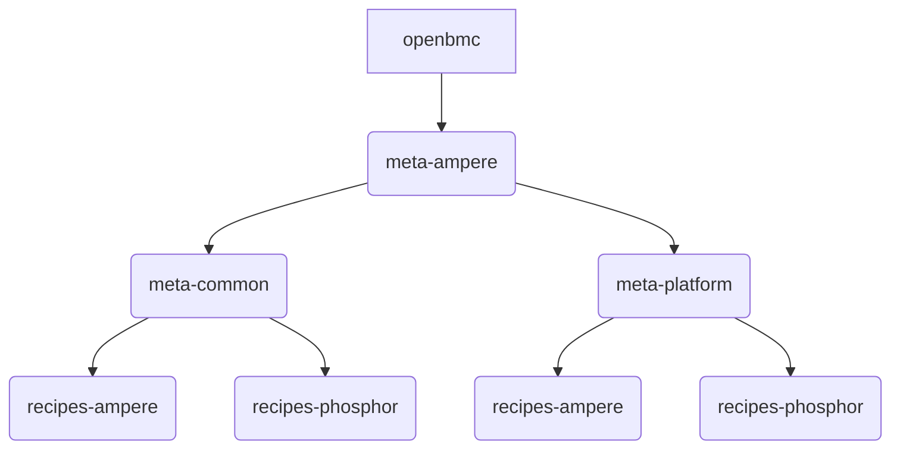

# Ampere OpenBMC Porting Guide

This document aims to guide users to port Ampere OpenBMC (Mt.Jade or Mt.Mitchell OpenBMC) to a new Altra or AmpereOne -based platform. Guideline for features that are not specific for Ampere reference platform is out of scope for this document.

It is expected that users have previous knowledge on developing OpenBMC. Otherwise, refer to links from the Reference section for basic knowledge on developing/porting OpenBMC for platforms.

## Ampere OpenBMC Repositories

- [linux][4]: Ampere Linux kernel, cloned from OpenBMC linux kernel and adds Mt.Jade device tree and other drivers listed in this document.
- [ssifbridged][1]: bridging between BMC SSIF driver and IPMI daemon. 
- [ampere-ipmi-oem][3]: Ampere IPMI OEM. Refer to its README file for the IPMI commands it supports.
- [ampere-platform-mgmt][2]: contain to handle Altra error monitoring and some utilities for flashing EEPROM.
- [ampere-misc](https://github.com/ampere-openbmc/ampere-misc): contain applications that provide workaround or temporary solutions that will be replaced later.
- [libmctp](https://github.com/ampere-openbmc/libmctp): Ampere libmctp, cloned from https://github.com/openbmc/libmctp with adding SMBUS support and some missing features for MCTP to work.
- [pldm](https://github.com/ampere-openbmc/pldm): Ampere pldm, cloned from https://github.com/openbmc/pldm with adding sensor and RAS support.

## Directory Structure



Where: platform = mtjade, mtmitchell, ...

- `meta-ampere/meta-common/recipes-ampere `: Contain Ampere-specific (but not platform specific) features, include:
	- host
		- [`ampere-hostctrl`](https://github.com/openbmc/openbmc/tree/master/meta-ampere/meta-common/recipes-ampere/host/ampere-hostctrl): contain services to check host state and host reset (via `SYS_RESET` pin)
		- [`ac01-boot-progress`](https://github.com/ampere-openbmc/openbmc/tree/ampere/meta-ampere/meta-common/recipes-ampere/host/ac01-boot-progress): check boot progress from Altra-based Host, update to dbus and log events to Redfish EventLog.
		- [`ac01-openocd`](https://github.com/ampere-openbmc/openbmc/blob/ampere/meta-ampere/meta-common/recipes-ampere/host/ac01-openocd.bb): OpenOCD support for Altra silicon.
		- [`ac03-openocd`](https://github.com/ampere-openbmc/openbmc/blob/ampere/meta-ampere/meta-common/recipes-ampere/host/ac03-openocd.bb): OpenOCD support for AmpereOne silicon.
	- network
		- [`ampere-usbnet`](https://github.com/openbmc/openbmc/tree/master/meta-ampere/meta-common/recipes-ampere/network/ampere-usbnet): create virtual USB Ethernet.
	- platform
		- [`ampere-utils`](https://github.com/ampere-openbmc/openbmc/blob/ampere/meta-ampere/meta-common/recipes-ampere/platform/ampere-utils.bb): utilities to flash Host firmware images.
		- [`ampere-driver-binder`](https://github.com/ampere-openbmc/openbmc/tree/ampere/meta-ampere/meta-common/recipes-ampere/platform/ampere-driver-binder): services to bind drivers after Host power on and Host running. Platform dependent scripts will implement specific commands to bind drivers.
- `meta-ampere/meta-common/recipes-phosohor`: Contain common features that can be used in different platforms.
	- flash
		- [`phosphor-software-manager`](https://github.com/ampere-openbmc/openbmc/tree/ampere/meta-ampere/meta-common/recipes-phosphor/flash/phosphor-software-manager): backend script to flash Host firmware.
- `meta-ampere/meta-jade/recipes-ampere `: Mt.Jade specific configuration, or contains some Mt.Jade specific configuration.
	- host
		- [`ampere-platform-mgmt`](https://github.com/ampere-openbmc/openbmc/tree/ampere/meta-ampere/meta-jade/recipes-ampere/host/ampere-platform-mgmt): application to monitor Host errors and log events.
	- platform
		- [`ampere-mac-update`](https://github.com/ampere-openbmc/openbmc/tree/ampere/meta-ampere/meta-jade/recipes-ampere/platform/ampere-mac-update): check BMC MAC Address from FRU's Board Extra and update the `eth1addr` u-boot variable.
- `meta-ampere/meta-jade/recipes-phosphor `: configure phosphor recipes with Mt.Jade specific information.
	- [`gpio`](https://github.com/ampere-openbmc/openbmc/tree/ampere/meta-ampere/meta-jade/recipes-phosphor/gpio): `phosphor-gpio-monitor` based GPIO application to handle GPIOs from Altra silicon.

## Linux kernel

Refer to [Ampere Linux kernel][4] for drivers and [device tree][12] for reference.

### Kernel drivers

Below kernel drivers are required for Ampere based platforms:

* [BMC SSIF driver](https://github.com/openbmc/linux/blob/dev-6.0/drivers/char/ipmi/ssif_bmc.c), enabled by the `CONFIG_SSIF_IPMI_BMC`
* [smpro-hwmon, smpro-errmon and smpro-misc](https://lwn.net/Articles/853975/) Linux hwmon driver, enabled by below kernel config:

	```
	CONFIG_HWMON=y
	CONFIG_MFD_SIMPLE_MFD_I2C=y
	CONFIG_MFD_CORE=y
	CONFIG_REGMAP_I2C=y
	CONFIG_MFD_SMPRO=y
	CONFIG_SMPRO_MISC=y
	CONFIG_SMPRO_ERRMON=y
	```

### Device Tree

* Altra smpro-hwmon, errmon and misc device nodes:

	```
		smpro@4f {
			compatible = "ampere,smpro";
			reg = <0x4f>;
		};
	```
* bmc-ssif device node

	```
        ssif-bmc@10 {
                compatible = "ssif-bmc";
                reg = <0x10>;
        };
	```

## IPMI SSIF

IPMI SSIF enables in-band IPMI communication between BMC and Host over I2C/SMBUS. To enable IPMI SSIF driver support, do the followings:

- Enable `obmc-host-ipmi-hw` with `phosphor-ipmi-ssif` in [board config](https://github.com/openbmc/openbmc/blob/master/meta-ampere/meta-jade/conf/machine/mtjade.conf) file:
```
PREFERRED_PROVIDER_virtual/obmc-host-ipmi-hw = "phosphor-ipmi-ssif"
```
- Enable SSIF channel configuration in [channel_config.json](https://github.com/openbmc/openbmc/blob/master/meta-ampere/meta-jade/recipes-phosphor/ipmi/phosphor-ipmi-config/channel_config.json) file.

```
	{
		"15": {
			"name": "ipmi_ssif",
			"is_valid": true,
			"active_sessions": 0,
			"channel_info": {
				"medium_type": "smbus-v2.0",
				"protocol_type": "ipmi-smbus",
				"session_supported": "session-less",
				"is_ipmi": true
			}
		}
	}
```

Ensure the `ssifbridge.service` service starts correctly and `/dev/ipmi-ssif-host` device node exists:

```
# systemctl status ssifbridge.service
# ls /dev/ipmi-ssif-host
```

## Altra CPU Sensors and Error Report

Working on Altra CPU sensors and error report requires the smpro-hwmon, smpro-errmon and smpro-misc drivers added and enabled. In addition, the drivers need to be bound when powering ON the Host.

The [`ampere-driver-binder`](https://github.com/ampere-openbmc/openbmc/blob/ampere/meta-ampere/meta-common/recipes-ampere/platform/ampere-driver-binder.bb) recipe is supported to check and bind the smpro-hwmon, smpro-errmon and smpro-misc when the Host is booted (if not bound before).

Porting to the new platform just needs to clone the code and update the [`drivers-conf.sh`](https://github.com/ampere-openbmc/openbmc/blob/ampere/meta-ampere/meta-jade/recipes-ampere/host/ampere-driver-binder/drivers-conf.sh) script if any change in the I2C addresses.

Below features assume that smpro drivers are already added, enabled and bound.

### Altra CPU Sensors

Altra CPU sensors feature work as below:

* The `smpro-hwmon` driver implements the hwmon framework which monitor register offset 0x10 - 0x4F (refer to the `Altra SoC BMC Interface Specification` document) and export /sys interface for sensors.
* The [`dbus-sensors`][9] application supports AmpereCPU driver ([45334](https://gerrit.openbmc-project.xyz/c/openbmc/dbus-sensors/+/45334), [45336](https://gerrit.openbmc-project.xyz/c/openbmc/dbus-sensors/+/45336) and [45335](https://gerrit.openbmc-project.xyz/c/openbmc/dbus-sensors/+/45335)) that monitor the sensors, update information to dbus. Sensor information, include threshold information) is defined in the entity-manager configuration file.

To support Altra CPU sensors on new platform:

* Add `smpro-hwmon` driver with device tree node and enable it.
* Add AmpereCPU dbus-driver support (port and use patches inside dbus-sensor recipe) while the code is still in review.
* Define sensor information in the entity-manager config. Refer to [Mt.Jade.json](https://github.com/ampere-openbmc/openbmc/blob/ampere/meta-ampere/meta-jade/recipes-phosphor/configuration/entity-manager/Mt_Jade.json). It is good to copy the node with `"Type":"smpro_hwmon"` and update I2C bus/address information for the new platform.


### Altra CPU Error Report

Altra CPU Error Reporting checks Altra CPU error information from its registers (0x50 - 0xAD) and log error information in IPMI SEL and Redfish EventLog.

Support Altra CPU Error Report requires the followings:

- Add `smpro-errmon` driver with device tree node and enable it.
- Add [ampere-platform-mgmt][2]'s `altra/host-monitor/error-monitor` application with configuration. Refer to Mt.Jade [`ampere-platform-mgmt.bb `](https://github.com/ampere-openbmc/openbmc/blob/ampere/meta-ampere/meta-jade/recipes-ampere/host/ampere-platform-mgmt.bb) recipe for reference.

### Altra Boot Progress Handling

The Boot Progress feature does the followings:

* Check for boot progress from smpro-misc's boot-progress /sys interface.
* Map the boot progress to dbus
* Check for DIMM Syndrom error when detecting DDR initialization failure. The DIMM errors will be logged to Redfish EventLog. 

To port this feature, clone the code at  [meta-ampere/meta-common/recipes-ac01/host/boot-progress](https://github.com/ampere-openbmc/openbmc/tree/ampere/meta-ampere/meta-common/recipes-ac01/host/boot-progress) to the new platform. No change is required.

## AmpereOne CPU Sensors and Error Report

AmpereOne CPU sensors and RAS Errors are supported by MCTP and PLDM. Need to enable below recipes with appropriate configuration for CPU sensors and RAS Error report to work:

* [libmctp](https://github.com/ampere-openbmc/openbmc/blob/ampere/meta-ampere/meta-mitchell/recipes-phosphor/libmctp/libmctp_%25.bbappend)
* [pldm](https://github.com/ampere-openbmc/openbmc/blob/ampere/meta-ampere/meta-mitchell/recipes-phosphor/pldm/pldm_%25.bbappend)
* [mctp-ctrl](https://github.com/ampere-openbmc/openbmc/blob/ampere/meta-ampere/meta-mitchell/recipes-ampere/host/mctp-ctrl.bb)

## Power Control

Altra silicon supports power control operations below:

| Redfish | IPMI | OpenBMC actions |
| --- | --- | --- |
| ForceOff | power down | DC power off host immediately |
| ForceOn | power up | DC power on host immediately |
| ForceRestart | hard reset | Trigger host `SYS_RESET` pin |
| GracefulShutdown | soft off | Graceful shutdown the host |
| GracefulRestart |  | Graceful shutdown host then DC power on |
| On | power up | Same as ForceOn |
| PowerCycle | power cycle | graceful shutdown then DC power on |

To implement power ON, OFF, cycle handling, declare GPIO pin information inside [skeleton](https://github.com/openbmc/skeleton)'s gpio_defs.json file for power good GPIO, GPIO signal to control power ON, ... Refer to Mt.Jade [gpio_defs.json](https://github.com/openbmc/openbmc/blob/master/meta-ampere/meta-jade/recipes-phosphor/skeleton/obmc-libobmc-intf/gpio_defs.json) file for an example implementation.

Graceful Shutdown in OpenBMC is implemented using SMS_ATN (Heartbeat) which is only available in IPMI KCS interface only. To implement graceful shutdown for Ampere Altra silicon, need to overwrite the `xyz.openbmc_project.Ipmi.Internal.SoftPowerOff.service` service which asserting the `SHUTDOWN_REQ` GPIO instead. Refer to [`phosphor-ipmi-host_%.bbappend`](https://github.com/openbmc/openbmc/blob/master/meta-ampere/meta-common/recipes-phosphor/ipmi/phosphor-ipmi-host_%25.bbappend) for how Ampere OpenBMC overwrite this service.

### Host power signal handling
In addition, it also supports operations from Host OS:

| Host | OpenBMC actions |
| --- | --- |
| reboot | Trigger `SYS_RESET` pin to reset host when detecting `REBOOT_ACK` GPIO asserted |
| poweroff/shutdown | Turn OFF the Host power when detecting `SHUTDOWN_ACK` GPIO asserted |

Handling `REBOOT_ACK` and `SHUTDOWN_ACK` GPIOs from Host can be done by using [`phosphor-gpio-monitor`][13]. Refer to Mt.Jade [`phosphor-gpio-monitor`](https://github.com/openbmc/openbmc/tree/master/meta-ampere/meta-jade/recipes-phosphor/gpio/phosphor-gpio-monitor) for the implementation.


## Host State Detection

OpenBMC's [phosphor-state-manager][6] just supports detect Host state via PLDM and IPMI (just available for IPMI KCS) which are not available in Ampere Altra-based platform. In Ampere Altra-based platform, a GPIO named `S0_FW_BOOT_OK` is used to identify if the Host is Running or Off.

To enable Host State detection via GPIO, define the GPIO with linename `host0-ready` in device tree, then enable the feature in [phosphor-state-manager](https://github.com/openbmc/openbmc/blob/master/meta-ampere/meta-common/recipes-phosphor/state/phosphor-state-manager_%25.bbappend)

```
EXTRA_OEMESON:append = " -Dhost-gpios=enabled"
```

## Firmware Update

OpenBMC supports firmware update for BMC and Host firmware. However, need to implement the backend code to flash Host firmware image. To do so, overwrite the `obmc-flash-host-bios@.service` service to add the script to execute the flashing.

Refer to the [`phosphor-software-manager`](https://github.com/openbmc/openbmc/tree/master/meta-ampere/meta-common/recipes-phosphor/flash/phosphor-software-manager) for how to overwrite for Host firmware update:

* Add `obmc-flash-host-bios@.service` which calls the `firmware_update.sh` script to execute the actual firmware flashing.
* The `firmware_update.sh` script will check the MANIFEST file for value of `EXTENDED_VERSION` in the MANIFEST file. Base on the value, will flash the firmware image into appropriate hardware device (Host SPI-NOR, Boot EEPROM,...)

Refer to [`code-update`](https://github.com/openbmc/docs/tree/master/architecture/code-update) document for design of OpenBMC firmware update.


## Reference

1. [https://github.com/mine260309/openbmc-intro/blob/master/Porting_Guide.md](https://github.com/mine260309/openbmc-intro/blob/master/Porting_Guide.md)
2. [IBM: How to port OpenBMC](https://developer.ibm.com/tutorials/how-to-port-openbmc/)
3. [OpenBMC Official Documentation](https://github.com/openbmc/docs)
4. [OpenBMC wiki](https://github.com/openbmc/openbmc/wiki)
5. [Yadro: OpenBMC overview](https://drive.yadro.com/s/jt8LpNEXoQZeXtE)

[1]: https://github.com/ampere-openbmc/ssifbridge
[2]: https://github.com/ampere-openbmc/ampere-platform-mgmt
[3]: https://github.com/ampere-openbmc/ampere-ipmi-oem
[4]: https://github.com/ampere-openbmc/linux
[5]: https://github.com/ampere-openbmc/openbmc
[6]: https://github.com/openbmc/phosphor-state-manager
[7]: https://github.com/openbmc/docs/blob/master/designs/device-tree-gpio-naming.md
[8]: https://github.com/openbmc/docs/blob/master/designs/bmc-reset-with-host-up.md
[9]: https://github.com/openbmc/dbus-sensors
[10]: https://github.com/openbmc/entity-manager
[11]: https://github.com/ampere-openbmc/linux/blob/ampere/drivers/misc/smpro-errmon.c
[12]: https://github.com/ampere-openbmc/linux/blob/ampere/arch/arm/boot/dts/aspeed-bmc-ampere-mtjade.dts
[13]: https://github.com/openbmc/phosphor-gpio-monitor
